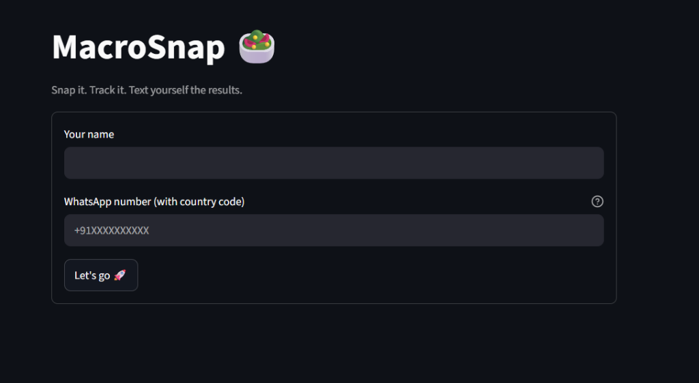
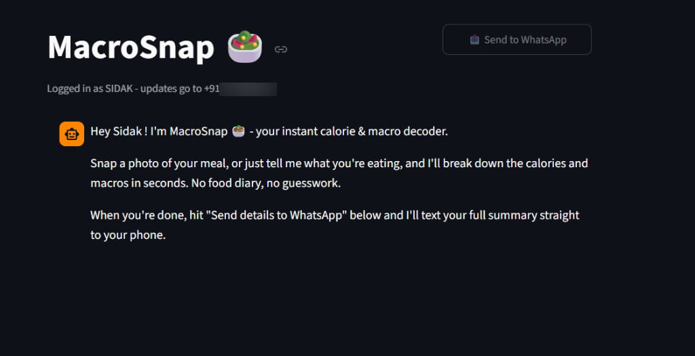
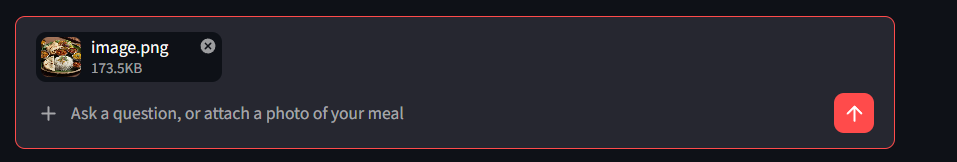
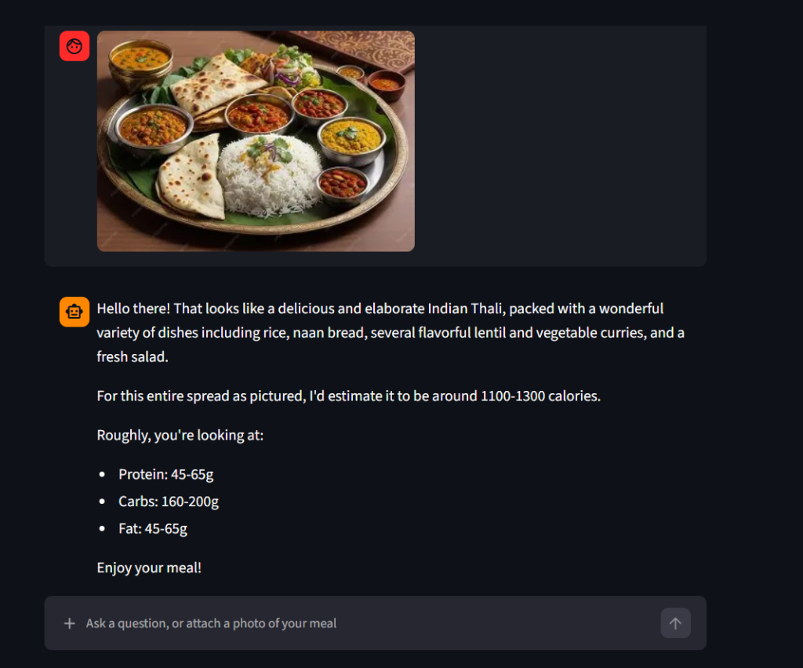

# MacroSnap 🥗 - AI Vision Nutrition Buddy

[](https://macrosnap-vkk2k8pjeidl9pvnehdsxm.streamlit.app)
[](https://www.python.org/)
[](https://deepmind.google/technologies/gemini/)
[](https://www.twilio.com/)

> **Snap it. Track it. Text yourself the results.**  
> MacroSnap is an intelligent nutrition assistant powered by **Google Gemini 2.5 Flash** and **Streamlit**. Snap or upload a photo of your meal (or describe it in text), and MacroSnap instantly identifies the dishes, estimates total calories, and calculates macronutrients (protein, carbs, and fats). When you're done, send the daily nutrition summary straight to your phone via WhatsApp with a single click!

🔗 **Live App URL:** [https://macrosnap-vkk2k8pjeidl9pvnehdsxm.streamlit.app](https://macrosnap-vkk2k8pjeidl9pvnehdsxm.streamlit.app)

---

## 📸 Screenshots & Demo Walkthrough

### 1. Simple Onboarding
Enter your name and WhatsApp number to begin tracking your meals.


### 2. Conversational Assistant
Your nutrition buddy welcomes you and prepares your daily tracking session.


### 3. Food Photo Upload
Snap a photo or upload an image of any meal directly inside the chat interface.


### 4. Instant Calorie & Macro Breakdown
Gemini 2.5 Flash accurately estimates dishes, portion sizes, calories, and protein/carbs/fat ratios.


---

## 🚀 Key Features

- **Multimodal Food Recognition**: Upload food photos or describe what you ate to receive an immediate breakdown.
- **Accurate Macro Estimates**: Estimates calories, protein, carbohydrates, and fats in an easy-to-read format.
- **WhatsApp Integration**: Automatically compiles a consolidated daily meal report and delivers it directly to your WhatsApp via Twilio.
- **Image Optimization**: Client-side and server-side image compression for rapid AI response times.

---

## 🛠️ Tech Stack

- **Frontend & App Framework**: [Streamlit](https://streamlit.io/)
- **Vision & Language AI**: [Google GenAI SDK](https://github.com/googleapis/python-genai) (`gemini-2.5-flash`)
- **Messaging API**: [Twilio REST API](https://www.twilio.com/) (WhatsApp Messaging & Content Templates)
- **Image Processing**: [Pillow (PIL)](https://python-pillow.org/)

---

## 📋 Getting Started Locally

### 1. Clone the Repository
```bash
git clone https://github.com/SidakSethi-Singh/Macrosnap.git
cd Macrosnap
```

### 2. Create and Activate a Virtual Environment
```bash
# Windows
python -m venv venv
.\venv\Scripts\Activate.ps1

# macOS / Linux
python3 -m venv venv
source venv/bin/activate
```

### 3. Install Dependencies
```bash
pip install -r requirements.txt
```

### 4. Configure Secrets
Create a `.streamlit/secrets.toml` file based on `.streamlit/secrets.toml.example`:

```toml
GEMINI_API_KEY = "your_gemini_api_key"
TWILIO_ACCOUNT_SID = "your_twilio_account_sid"
TWILIO_AUTH_TOKEN = "your_twilio_auth_token"
TWILIO_WHATSAPP_FROM = "+14155238886"
TWILIO_CONTENT_SID = "your_twilio_content_sid"
```

### 5. Run the Application
```bash
streamlit run app.py
```

---

## 🌐 Deployment

MacroSnap is deployed on **Streamlit Community Cloud**:
- **Live URL**: [https://macrosnap-vkk2k8pjeidl9pvnehdsxm.streamlit.app](https://macrosnap-vkk2k8pjeidl9pvnehdsxm.streamlit.app)

To deploy your own fork:
1. Push your repository to GitHub.
2. Sign in to [share.streamlit.io](https://share.streamlit.io/) with GitHub.
3. Select your repository, branch `main`, and main file `app.py`.
4. In **Settings → Secrets**, paste the keys from your `secrets.toml`.
5. Click **Deploy**!
